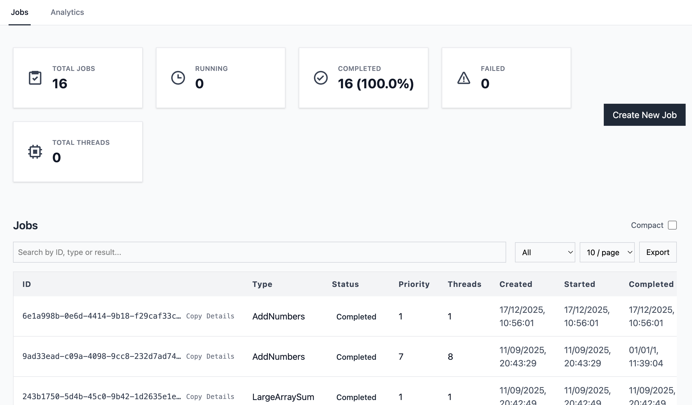

# Distributed Job Scheduler

A distributed job scheduling system built in Go, featuring priority-based scheduling, worker thread pools, and multi-threaded job execution. Includes a React frontend for job management and real-time monitoring.

I built this because I was really interested in learning about distributed systems, job scheduling, worker pools, and concurrent execution. I find the best way to learn something is to try and build it myself, so I did!



---

## Architecture
```
┌─────────────────────────────────────────────────────────────────┐
│                         HTTP API (Gin)                          │
│                  POST /jobs  ·  GET /jobs  ·  GET /jobs/:id     │
└─────────────────────────────┬───────────────────────────────────┘
                              │
                              ▼
┌─────────────────────────────────────────────────────────────────┐
│                      Priority Queue Scheduler                   │
│            Heap-based queue ordered by priority + timestamp     │
│                 Thread-aware job-to-worker assignment           │
└──────────┬──────────────────────────────────────┬───────────────┘
           │                                      │
           ▼                                      ▼
┌────────────────────────┐             ┌────────────────────────┐
│       Worker 1         │             │       Worker 2         │
│   Thread Pool (n=4)    │             │   Thread Pool (n=8)    │
│   ┌───┬───┬───┬───┐    │             │   ┌───┬───┬───┬───┐    │
│   │ T │ T │ T │ T │    │             │   │ T │ T │...│ T │    │
│   └───┴───┴───┴───┘    │             │   └───┴───┴───┴───┘    │
└────────────────────────┘             └────────────────────────┘
           │                                      │
           └──────────────────┬───────────────────┘
                              ▼
┌─────────────────────────────────────────────────────────────────┐
│                        Persistence Layer                        │
│              Redis (job cache)  ·  PostgreSQL (history)         │
└─────────────────────────────────────────────────────────────────┘
```

---

## Key Technical Decisions

### Priority Queue with Thread Awareness
The scheduler uses a heap-based priority queue that considers both job priority and worker thread availability. Jobs specify a `thread_demand`, and the scheduler assigns jobs to workers that can satisfy the requirement—or falls back to single-threaded execution when no worker has the multi-threaded capacity.

### Per-Worker Thread Pools
Each worker maintains a thread pool implemented as a buffered channel. This bounds concurrency per worker and enables efficient resource utilization without oversubscription.

### Chunked Parallel Execution
Jobs like `large_array_sum` support multi-threaded execution by partitioning work into chunks. Each chunk executes on a separate goroutine, with results aggregated using a per-job mutex to avoid global contention.

### Dual-Layer Persistence
Active jobs are cached in Redis for fast lookups. Completed jobs are persisted to PostgreSQL with execution metrics (queue time, execution time, total time) for historical analysis.

---

## Basic Supported Job Types

The jobs themselves were not the focus of this project, so I just added some basic ones to test different features of the scheduler like concurrency.

| Type | Description | Parallelizable |
|------|-------------|----------------|
| `add_numbers` | Sum two integers | No |
| `reverse_string` | Reverse input string | No |
| `resize_image` | Simulated image processing | No |
| `large_array_sum` | Sum large integer array | Yes (chunked) |

---

## Quick Start
```bash
# Clone and start all services
git clone https://github.com/samrichellsmith/distributed-job-scheduler.git
cd distributed-job-scheduler
docker compose up

# API available at http://localhost:8080
# Frontend available at http://localhost:5173
```

### Submit a job
```bash
curl -X POST http://localhost:8080/jobs \
  -H "Content-Type: application/json" \
  -d '{
    "name": "Sum large array",
    "type": "large_array_sum",
    "priority": 10,
    "thread_demand": 4,
    "payload": {
      "numbers": [1, 2, 3, 4, 5, 6, 7, 8, 9, 10]
    }
  }'
```

### Query jobs
```bash
# Active jobs (in-memory)
curl http://localhost:8080/jobs

# Historical jobs (from PostgreSQL)
curl http://localhost:8080/db/jobs

# Single job (checks Redis cache first)
curl http://localhost:8080/jobs/{id}
```

---

## Project Structure
```
├── cmd/
│   ├── api.go                 # HTTP server, job registry, worker init
│   └── api_smoke_test.go      # Integration tests (build tag: integration)
├── internal/
│   ├── job/                   # Job model, payloads, execution logic
│   ├── scheduler/             # Priority queue and scheduler
│   └── worker/                # Worker runtime and thread pool
├── db/
│   └── schema.sql             # PostgreSQL schema
├── frontend/                  # React + Vite UI
└── docker-compose.yml
```

---

## Running Tests
```bash
# Unit tests
go test ./... -v

# Integration tests (requires running services)
docker compose up -d
go test -tags=integration ./cmd -v

# Frontend tests
cd frontend && npm test
```

---

## Configuration

Environment variables (via `.env` or Docker Compose):

| Variable | Description | Default |
|----------|-------------|---------|
| `API_PORT` | HTTP server port | `8080` |
| `WORKER_1_THREADS` | Thread pool size for worker 1 | `4` |
| `WORKER_2_THREADS` | Thread pool size for worker 2 | `8` |
| `POSTGRES_*` | PostgreSQL connection settings | — |
| `REDIS_*` | Redis connection settings | — |

---

## Tech Stack

**Backend:** Go, Gin, pgxpool, go-redis  
**Frontend:** React, TypeScript, Vite, react-window  
**Infrastructure:** PostgreSQL, Redis, Docker

---

## License

MIT